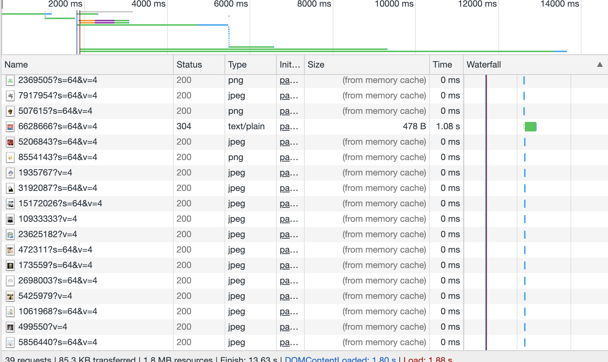
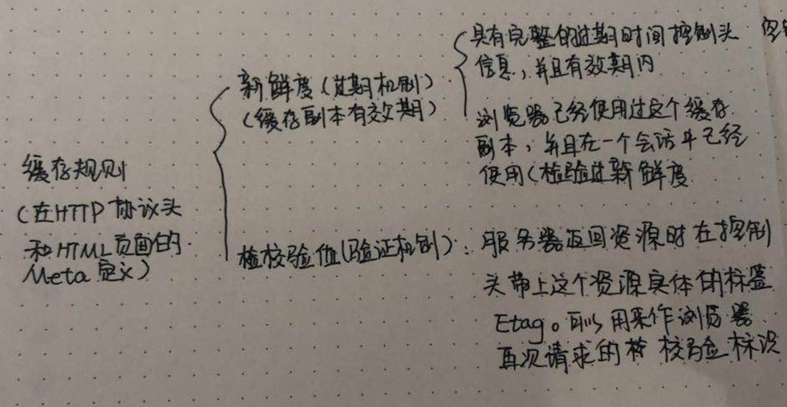
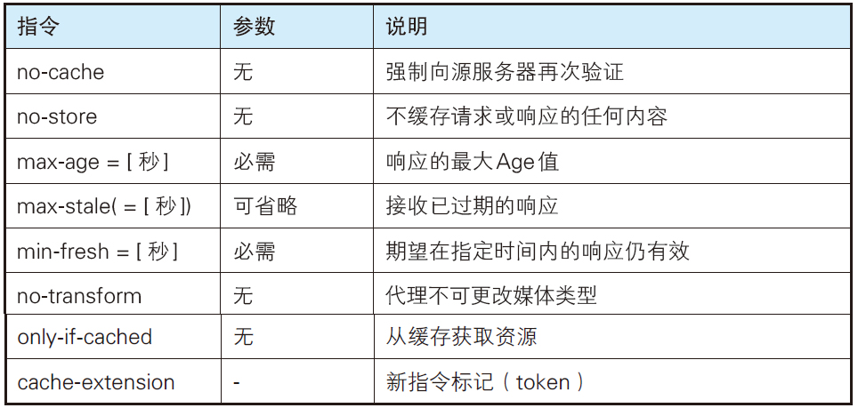
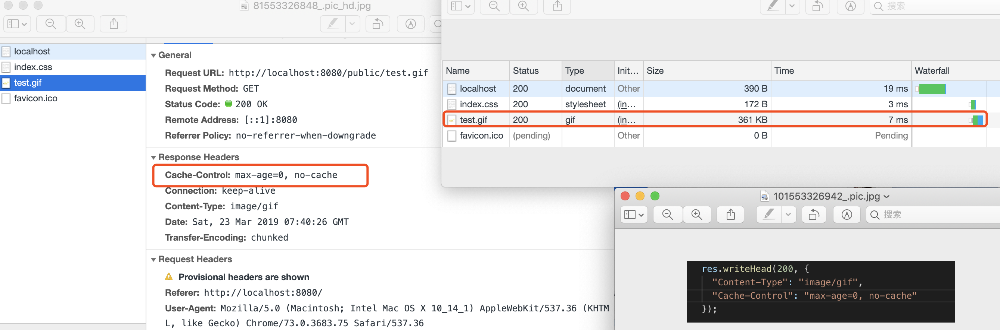
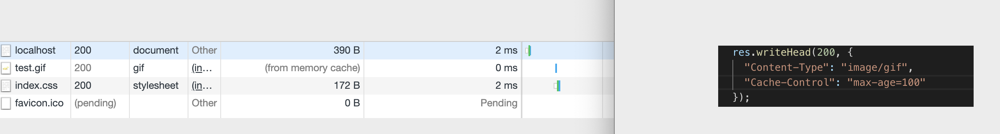
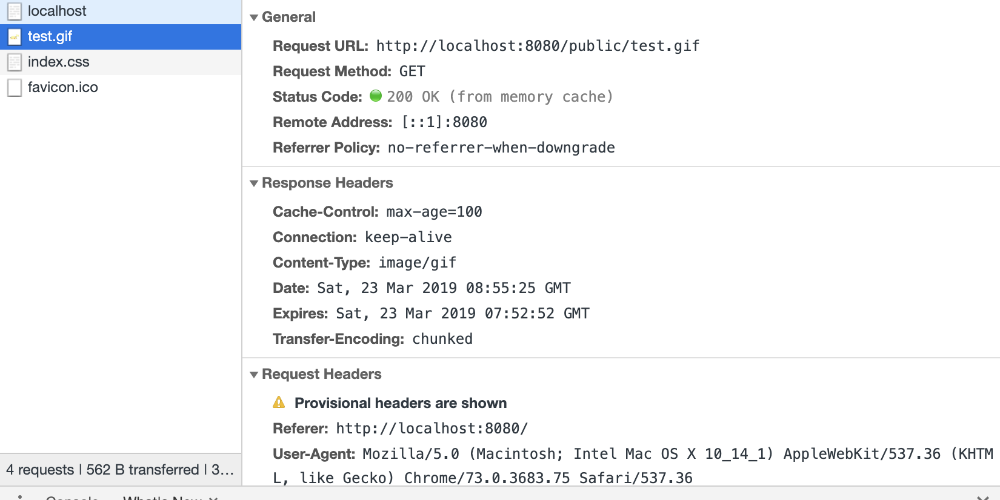

## 浏览器缓存

> 个人理解: 已经请求过的 web，会拷贝一份副本有存储在浏览器中，浏览器根据进来的请求，保存一份他的输出内容。当下一个请求过来的时候，如果是相同的 url，会根据缓存机制直接使用副本相应请求，或者再向服务器发送请求。

### 为毛要使用缓存呢～

- 减少网络宽带消耗。当 Web 缓存副本被使用时，只会产生极小的网络流量，可以有效的降低运营成本。

- 降低服务器压力。给网络资源设定有效期之后，用户可以重复使用本地的缓存，减少对源服务器的请求，间接降低服务器的压力。同时，搜索引擎的爬虫机器人也能根据过期机制降低爬取的频率，也能有效降低服务器的压力。

- 减少网络延迟，加快页面打开速度。

### 浏览器的缓存规则

#### 涉及到的字段

- Cache-control:就是能够操作缓存的工作机制。指令的参数是可以选的。可以用逗号隔开。eg：Cache-Control: private, max-age=0, no-cache。（ps: max-age=[秒]）
  
  没有缓存的 demo 的截图:
  
  有缓存的 demo 截图:
  

> public：其他用户也可以利用缓存
> private：相应只给特定的客户做对象，跟 public 的行为相反
> no-cache： 防止从缓存中返回过期的资源。
> s-maxage: 跟 `max-age` 差不多的。不同点在 `s-maxage` 指令只适用于供多位用户使用的公共缓存服务器
> max-age：如果判定缓存资源的缓存时间数值比指定时间的数值更小，那么客户端就接收缓存的资源。另外，当指定 `max-age` 值为 0，那么缓存服务器通常需要将请求转发给源服务器。应用 `HTTP/1.1` 版本的缓存服务器遇到同时存在 `Expires` 首部字段的情况时，会优先处理 `max-age` 指令，而忽略掉 `Expires` 首部字段。而 `HTTP/1.0` 版本的缓存服务器的情况却相反，`max-age` 会被忽略掉.
> 

...未完待续

- Expires：资源失效日期告诉客户端。
